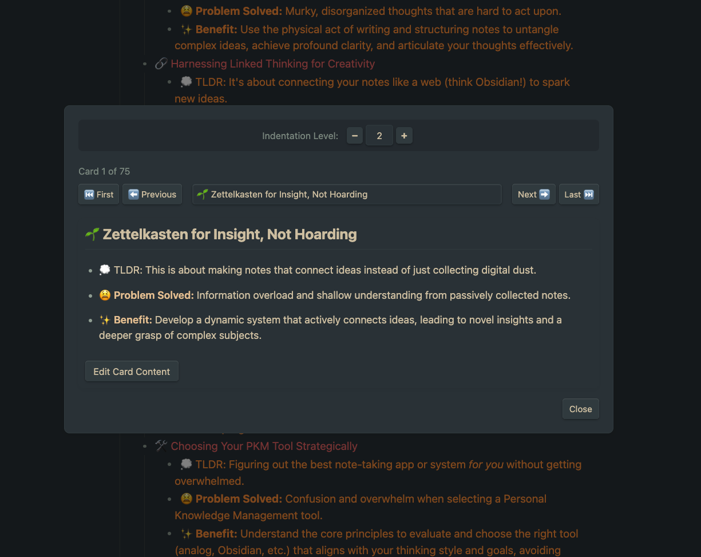
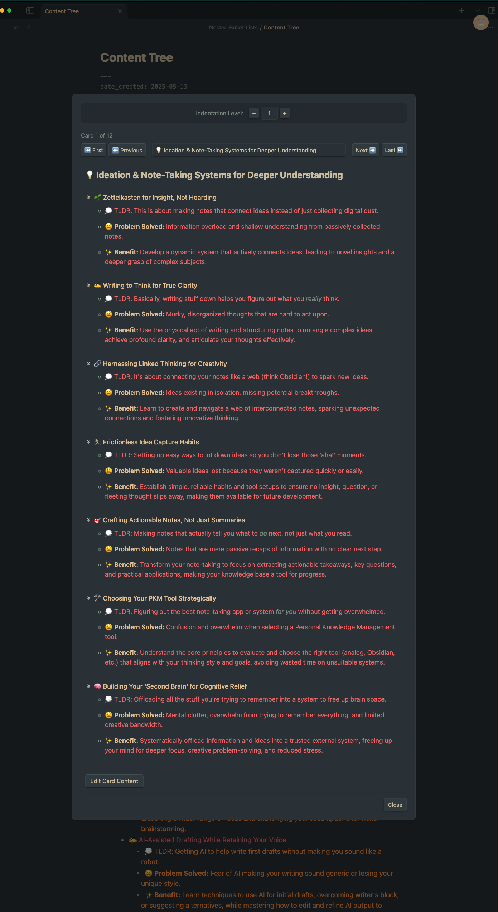

# Outliner Card View Plugin

The **Outliner Card View Plugin** transforms your nested bullet lists in Obsidian into a focused, card-based viewing experience. Navigate through your outline point by point, focusing on one section at a time without losing the context of your hierarchical structure.

## Video
1 minute preview: [Obsidian Game-Changer: Convert ANY Nested Bullet List to Focused Cards INSTANTLY! 🎯 - YouTube](https://youtu.be/VDxBUQ4sGuo)

[Post Explaination](https://typefully.com/MwahaCookie/RnMcnpm)

## Features

- 🎯 **Focused Card View**: Convert any indentation level of bullet points into separate cards for focused reading and editing
- 🔍 **Selective Level Display**: Choose which level of indentation becomes your card headings

- 📱 **Easy Navigation**: Use arrow keys or the card selector to move between cards
  - Quick-jump dropdown selector for direct card access
  - First/Last card navigation buttons
  - Card counter showing current position
- 🔍 **Quick Access Hover Icons**: Hover over any bullet point to see a quick-access icon for viewing that section as cards (can be disabled in settings)
- ✏️ **Interactive Editing**: Edit content from cards with a jump to original document location

## Instructions
Instructions:
Put main.js, manifest.json and styles.css into a folder and put that folder into your .obsidian/plugins folder

## How to Use

1. Open any note with nested bullet points
2. Access the card view in three ways:
   - Press `Ctrl/Cmd+Shift+O` to toggle the card view
   - Hover over any bullet point and click the 🔍 icon
   - Use the command palette and search for "Toggle Card View"
3. Navigate between cards using:
   - `Alt+Left` and `Alt+Right` arrow keys
   - Navigation buttons (Previous/Next)
   - Card selector dropdown
   - First/Last card buttons
4. Press "Edit Card Content" to modify content directly
5. Press `Escape` to exit the card view

## Settings

Customize the Outliner Card View Plugin in the Obsidian settings tab:

- **Default Indentation Level**: Choose which level of bullet points to display as cards (1 = top level)
- **Card View Position**: Select where to display the card view panel
- **Show Card Title**: Toggle displaying the bullet point text as the card title
- **Allow Editing**: Enable or disable direct editing of card content
- **Show Card Navigation**: Toggle navigation controls for moving between cards
- **Card Transition Animation**: Enable smooth transition animations between cards
- **Show Hover Buttons**: Toggle the quick-access hover icons on bullet points

## Use Cases

- **Study Notes**: Focus on one concept at a time while studying complex material
- **Meeting Notes**: Jump between discussion topics without losing context
- **Project Outlines**: Review project components individually
- **Writing**: Work on one section of your document at a time
- **Knowledge Management**: Browse through nested hierarchies of information

## Keyboard Shortcuts

- `Ctrl/Cmd+Shift+O`: Toggle the card view
- `Alt+Left Arrow`: Navigate to previous card
- `Alt+Right Arrow`: Navigate to next card
- `Escape`: Close the card view

## Tips

- For best results, maintain consistent indentation in your bullet lists
- Higher indentation levels (2-3) typically work best for creating meaningful cards
- Add a brief summary at each level to create informative card titles
- Use markdown formatting within your bullets - it will be preserved in the cards

## Feedback and Support

Found a bug or have a feature request? Please open an issue on the [GitHub repository](https://github.com/Caffa/outliner-card-view).

## Support me 👋🏻 With Feedback

If you find Outliner Card View useful, I’d truly appreciate your support. Please consider buying me a coffee on [Ko-fi](https://ko-fi.com/pamelawang_mwahacookie) — your contribution helps me keep making tools that make our creative lives easier.

If a coffee is too much, I would also really appreciate a screenshot of how you use this. Workflow inspiration please.

Thank you for being a part of this adventure. Happy note-taking and connecting those brilliant ideas!

